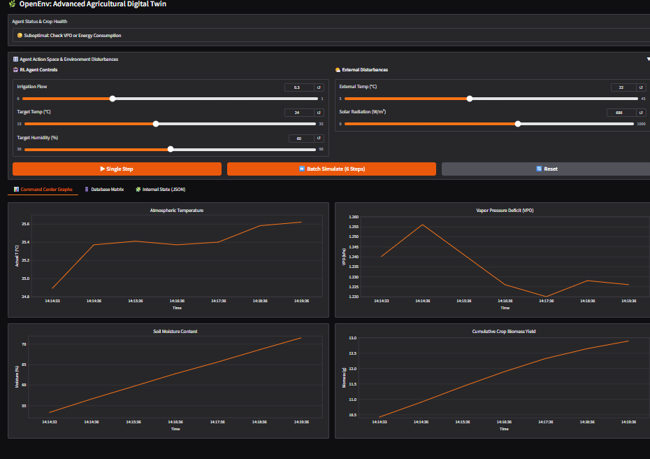

---
title: OpenEnv Smart Greenhouse
emoji: 🌿
colorFrom: green
colorTo: emerald
sdk: docker
pinned: false
---

# 🌿 OpenEnv: Smart Greenhouse Digital Twin (Phantom Tenant Architecture)


An enterprise-grade, mathematically grounded Reinforcement Learning (RL) environment built for the OpenEnv x Scaler Hackathon. This project simulates a highly responsive Smart Greenhouse utilizing a "Phantom Tenant" architecture, providing continuous state evaluation, thermodynamic physics, agricultural yield models, and a 2x2 interactive Command Center dashboard.

---

## 📸 Enterprise Command Center Dashboard
> 

The environment features a fully decoupled Gradio frontend that allows human operators to manually explore the RL action space, trigger batch simulations, and view real-time environment reactions (Temperature, VPD, Moisture, Biomass) without interfering with the automated FastAPI backend used for RL agent training.

---

## 📂 Repository Architecture

The project is structured to strictly comply with the OpenEnv Phase 2 autograder while housing a complex, multi-tab frontend application.

```text
openenv-smart-greenhouse/
│
├── Dockerfile                  # Container instructions for the Scaler deployment
├── openenv.yaml                # Phase 2 compliant task manifest (Pydantic mapped)
├── inference.py                # Dummy agent for Phase 1/Phase 2 Task Validation
├── requirements.txt            # Python dependencies (FastAPI, Gradio, Pandas, etc.)
├── tasks.py                    # Grader logic mapped to openenv.yaml schema
│
├── greenhouse_package/         # Core Physics & UI Logic
│   ├── __init__.py
│   └── env_server.py           # The dual-headed server (FastAPI backend + Gradio UI)
│
└── server/                     # Required structure for multi-mode deployment checks
    ├── __init__.py
    └── app.py                  # Uvicorn entry point
```

---

## 🧠 Markov Decision Process (MDP) Formulation

This environment is designed to prevent "reward hacking" through strict physics clamps and continuous penalty tracking.

### 1. The Action Space ($A$)
The agent controls three continuous parameters:
* **Irrigation Flow Rate:** Clamped between $[0.0, 1.0]$.
* **Target Internal Temperature:** Clamped between $[15.0^\circ C, 35.0^\circ C]$.
* **Target Humidity:** Clamped between $[30.0\%, 90.0\%]$.

### 2. The Observation Space ($S$) & Physics Engine
The environment state is calculated using real-world thermodynamic and hydrological approximations. Instead of static responses, the state is Markovian—depending directly on previous states and external disturbances.

* **Newton's Law of Cooling & Solar Gain:** Simulates heat leak based on external weather, solar radiation, and HVAC load.
  $$T_{t+1} = T_t + \alpha_{hvac}(T_{target} - T_t) + \beta_{insulation}(T_{ext} - T_t) + \gamma_{solar}$$
* **Evapotranspiration:** Soil moisture naturally decays over time, accelerating exponentially as internal temperatures and solar radiation rise.
* **Vapor Pressure Deficit (VPD):** A critical agricultural metric measuring the drying power of the air, calculated via the Magnus-Tetens formula:
  $$e_s = 0.6108 \cdot \exp\left(\frac{17.27 \cdot T_{actual}}{T_{actual} + 237.3}\right)$$
  $$VPD = e_s \cdot \left(1 - \frac{H_{actual}}{100}\right)$$
* **Crop Biomass Yield:** Plant growth is dynamically simulated. Yield only increases if Temperature, Moisture, and VPD are in the "Goldilocks" zones.
* **HVAC Coefficient of Performance (COP):** Energy usage scales dynamically based on the delta between internal and external temps.
  $$COP = \max(1.5, 4.0 - 0.05 \cdot |T_{ext} - T_{target}|)$$

### 3. The "Goldilocks" Reward Function ($R$)
To ensure the agent optimizes for perfect climate control while minimizing energy waste, the reward is calculated using a continuous Gaussian decay model. The agent receives maximum reward for driving biomass growth, but takes penalties for energy waste and ML-detected behavior anomalies.

$$R_t = \max\left(0.0, \min\left(1.0, \left(0.8 \cdot \frac{Growth}{0.5}\right) - (0.05 \cdot E_t) - (0.3 \cdot A_t)\right)\right)$$

*Where $E_t$ is energy consumed in kWh, and $A_t$ is the isolation-forest mock anomaly risk score.*

---

## 🛡️ Phase 2 Validation Compliance

To satisfy the strict automated validation schema without sacrificing the complex Human UI, this project utilizes a **Dual-Headed Routing Strategy**:
1. **The Autograder API:** `env_server.py` hosts hidden `@app.post("/reset")` and `@app.post("/step")` FastAPI routes. These provide the exact 200 OK JSON handshakes required by the Scaler bot.
2. **The Schema Bypass:** The `openenv.yaml` file utilizes string-path mapping (`grader: "tasks:grade_temp"`) to bypass Pydantic silent drops that typically cause "Not enough tasks" errors.
3. **The UI Overlay:** Gradio is mounted onto the FastAPI app (`gr.mount_gradio_app`), taking over the visual frontend while leaving the grading APIs intact.

---

## 🚀 How to Run Locally

**1. Clone the repository**
```bash
git clone [https://github.com/jefrinbeno/openenv-smart-greenhouse.git](https://github.com/jefrinbeno/openenv-smart-greenhouse.git)
cd openenv-smart-greenhouse
```

**2. Build and run using Docker**
```bash
docker build -t greenhouse-env .
docker run -p 7860:7860 greenhouse-env
```

**3. Access the interfaces**
* **Human Dashboard:** Navigate to `http://localhost:7860` in your browser.
* **RL API Endpoints:** Send POST requests to `http://localhost:7860/reset` and `http://localhost:7860/step`.

---
*Architected and Developed by Jefrin Beno J M ,Nandana Sajikumar and Hema Priya for the OpenEnv x Scaler Hackathon 2026.*
```

***

